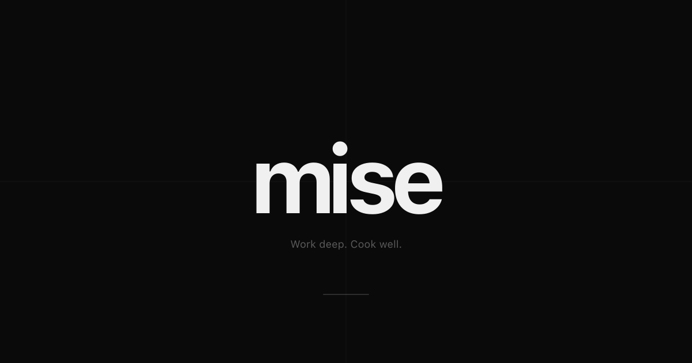

# Misse

A focus timer and kitchen timer that share one interface. The idea is simple: the same minimal clock that tracks your work sessions should also tell you when your pasta is done.

No backend, no accounts, no installs. Runs entirely in the browser.



---

## Overview

Most focus timer apps are either too bare (no real customization) or too bloated (accounts, dashboards, gamification). Misse sits in the middle. Structured enough to work out of the box, flexible enough to adapt to your workflow.

The kitchen timer started from a small but real frustration: having one timer for deep work and another one for cooking breaks your flow. In both cases you’re just running a timer, so they should live in the same place.

---

## Features

### Work Context

| Mode | Description |
|------|-------------|
| **Pomodoro** | Classic 25 min work / 5 min break with automatic long-break cycle every 4 sessions |
| **Deep Work** | 50 min focused blocks with configurable round count (2–6) |
| **Custom** | Named timer with freely configurable work duration, break duration, and round count |

- Session progress tracker with visual dot indicators
- Daily session counter with 7-day bar chart history (auto-resets at midnight)
- Escalating narrative labels: `Starting → Focused → Deep → Locked in → Rare`
- Skip button to advance to the next phase without waiting

### Cook Context

| Mode | Description |
|------|-------------|
| **Pasta** | Fresh (3 min), Thin (8 min), Regular (11 min), Thick (14 min) |
| **Egg** | Soft (4 min), Jammy (7 min), Hard (12 min) |
| **Sauce** | Sequential phase timer — Quick (22 min) or Slow (50 min): Soffritto → Add tomatoes → Simmer |
| **Custom** | Fully user-defined multi-stage sequence with named stages and configurable durations |

- Phase timeline visualization for multi-stage modes (Sauce, Custom)
- Total remaining countdown across all phases

### Global

- Dark and light theme with CSS variable transitions
- Persistent settings via `localStorage` — all preferences survive refresh
- Alarm chime on timer completion (Web Audio API, no files)
- Full keyboard control: `Space` to toggle, `R` to reset, `S` to skip
- Animated splash screen on first load
- Fully responsive — mobile and desktop
- Accessible: ARIA labels, keyboard navigation, visible focus rings

---

## Architecture

```
src/
├── App.tsx                   # Root — state orchestration, routing between contexts
│
├── components/
│   ├── timer-display.tsx     # Large monospace clock face
│   ├── mode-indicator.tsx    # Label above the clock (e.g. "Deep Work · 3")
│   ├── controls.tsx          # Start / Pause / Reset button cluster
│   ├── session-tracker.tsx   # Dot progress row + SauceTimeline phase bar
│   ├── settings-panel.tsx    # Right-side panel: context/mode/duration pickers + dashboard
│   ├── progress-ring.tsx     # SVG ring (available, not active in default layout)
│   ├── time-selector.tsx     # Reusable duration pill-picker
│   └── context-switcher.tsx  # Work / Cook toggle
│
├── hooks/
│   ├── use-pomodoro.ts       # Core work timer — Pomodoro, Deep Work, Custom modes
│   ├── use-cook-timer.ts     # Cook timer — delegates to sub-timers per mode
│   ├── use-phase-timer.ts    # Sequential phase runner (used by Sauce + Custom cook)
│   ├── use-alarm.ts          # Web Audio API alarm on completion
│   ├── use-keyboard.ts       # Global keyboard shortcut bindings
│   └── use-local-storage.ts  # Type-safe localStorage hook with JSON serialization
│
└── lib/
    ├── types.ts              # Shared TypeScript types and interfaces
    ├── constants.ts          # All timer configs, variant definitions, mode presets
    ├── narrative.ts          # Escalating focus label logic
    └── utils.ts              # Helpers (minutesToSeconds, cn, etc.)
```

### State model

No external state library. All state is local React (`useState`, `useEffect`, `useCallback`) with a thin `useLocalStorage` wrapper for persistence. Timers are `setInterval` at 1s intervals with stale-closure-safe callbacks. Each timer mode is an independent hook — `App.tsx` selects the active one based on context + mode and routes controls to it. Switching context resets all timers.

Multi-phase timers (`usePhaseTimer`) take an array of `{ label, seconds }` and advance automatically at phase end. `SauceTimeline` reads `currentPhaseIndex` for the visual progress bar.

### Design system

All visual properties — spacing, color, typography, radii, motion, breakpoints — are CSS custom properties in `src/index.css`. Components reference tokens, never hardcoded values.

```css
--text-timer: clamp(72px, 22vw, 112px)  /* fluid clock, scales with viewport */
--color-work: #E8422A                    /* burnt red-orange — active state */
--color-break: #707070                   /* cool grey — rest state */
--clock-anchor: 38%                      /* vertical pin for the clock zone */
--ease: cubic-bezier(0.16, 1, 0.3, 1)   /* all transitions share one curve */
```

Theme (`data-theme="dark|light"`) and accent (`data-mode="work|break"`) cascade automatically from two data attributes on the root. No per-component theme logic.

---

## Technology Stack

| Layer | Technology | Version |
|-------|-----------|---------|
| **Language** | TypeScript | ~5.9 |
| **UI Library** | React | ^19.2 |
| **Build Tool** | Vite | ^7.3 |
| **Styling** | Tailwind CSS v4 | ^4.2 |
| **Typography** | Geist + Geist Mono (Vercel) | ^1.7 |
| **Package Manager** | pnpm | — |
| **Linting** | ESLint + typescript-eslint | ^9 / ^8 |
| **Runtime** | Browser — no server required | — |

---

## Getting Started

**Prerequisites:** Node.js 18+, pnpm (`npm install -g pnpm`)

```bash
pnpm install
pnpm dev        # → http://localhost:5173
pnpm build      # → dist/  (static, deploy anywhere)
pnpm preview    # test the production build locally
```

---

## Keyboard Shortcuts

| Key | Action |
|-----|--------|
| `Space` | Start / Pause |
| `R` | Reset current timer |
| `S` | Skip to next phase |

Disabled while the Settings panel is open.

---

## Design Principles

Dieter Rams: good design is as little design as possible. Every element earns its place.

- **One primary action at a time.** The Start button is the focal point. Everything else recedes.
- **Color carries meaning.** Red = work / active. Grey = break / passive. The whole UI shifts.
- **Numbers are the UI.** No decorative progress bars competing with the clock.
- **State persists without ceremony.** Settings survive refresh. History survives midnight.

---

## Notes for contributors

- **No state library.** Don't add one unless Stage 2 complexity genuinely demands it.
- **Tokens first.** New colors or spacing values go into `src/index.css` as custom properties, not inline.
- **Timer logic stays in hooks.** `App.tsx` wires things together — it doesn't count seconds.
- **Cook and Work are independent.** Switching context resets both. This is intentional.
- **The splash screen is self-contained** at the bottom of `App.tsx` — no external deps.

---

## Roadmap

| Stage | Status | Notes |
|-------|--------|-------|
| Stage 1 — Core timer | Pomodoro, Deep Work, Custom, Cook, Settings, Keyboard, Alarm |  Done 
| Stage 2 — Personalization | Planned | Sound selection, custom themes, session goals | Done 
| Stage 3 — PWA | Planned | Offline support, installable, push notifications |  Done 

---

## License

© 2026 Double Perez. All rights reserved.
